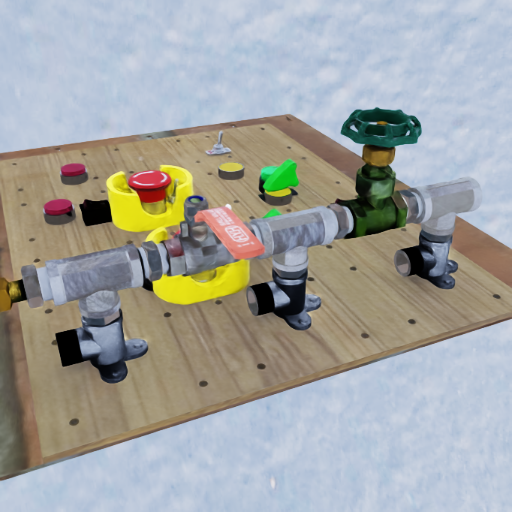
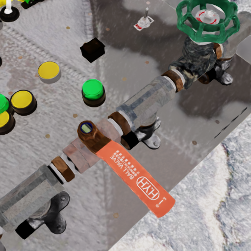
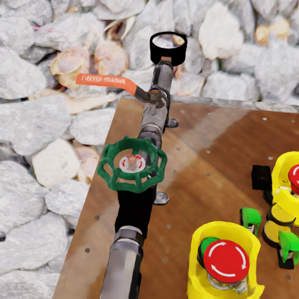
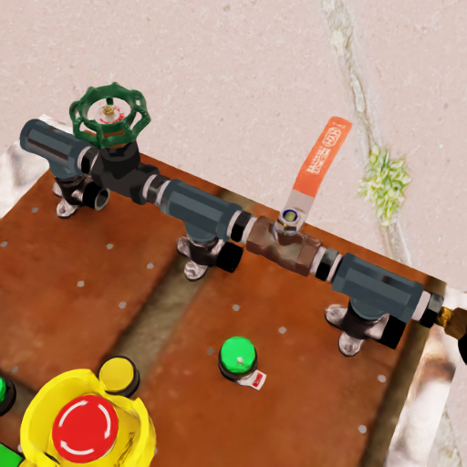

# Synthetic Data Generation and Training with Sim Ready Assets
This project provides a method to generate synthetic data that can be directly used to train an object pose estimation model. We will use Isaac Sim with Omniverse Replicator to generate data for our use case and objects of interest. 
## Workflow Components:
* Generating Data: Use Isaac Sim to generate data

### SDG 
- Use any object with usd file

- Carry out Domain Randomization in the scene with Replicator:
    - Various attributes of the scene like lighting, textures, object pose and materials can be modified 
    - Important to generate a good quality dataset to ensure model detects objects in the real world

- Data output Pose format with projected keypoints
    - Can be directly used to train an object pose model such as [DOPE](https://github.com/NVlabs/Deep_Object_Pose)

#### Requirements
- Install Isaac Sim [Omniverse](https://www.nvidia.com/zh-tw/omniverse/)
- Create a local Nucleus server with both account and password `admin` and put your target 3D models into the server
- Please make sure that your 3D model is a single prim rather than multiple prims with joints. Use the utility `Merge Mesh Utility` in Isaac Sim to merge all joints into one
- We tested on Ubuntu 24.04 with a Nvidia RTX3070 ti gpu and it can generate about 10,000 data in an hour

#### How to generate data
First add the path in the nucleus server of target objects in [random_objects.py](random_buttons.py), then modify the path of isaac sim, output path, and the output image specs in [generate_data.sh](generate_data.sh)

After modifying poth scripts, run:
```
bash generate_data.sh
```

- Sample generated images:

<p>
    
    
</p>

<p>
    
    
</p>

***Note***
If you are using the data to train DOPE, note that the order of the keypoints is not the same.

## References:
- Real world images from the [LOCO dataset](https://github.com/tum-fml/loco) are used for visualizing model performance
