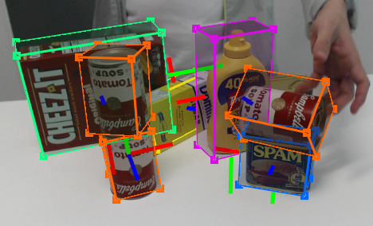

[](https://creativecommons.org/licenses/by-nc-sa/4.0/legalcode)

# Deep Object Pose Estimation

This is the official repository for NVIDIA's Deep Object Pose Estimation, which performs detection and 6-DoF pose estimation of **known objects** from an RGB camera.  For full details, see our [CoRL 2018 paper](https://arxiv.org/abs/1809.10790) and [video](https://youtu.be/yVGViBqWtBI).





## Contents
This repository contains complete code for [training](train), [inference](inference), numerical [evaluation](evaluate) of results, and synthetic [data generation](data_generation) using either  [NVISII](https://github.com/owl-project/NVISII) or [Blenderproc](https://github.com/DLR-RM/BlenderProc).  We also provide a [ROS1 Noetic package](ros1) that performs inference on images from a USB camera.

Hardware-accelerated ROS2 inference can be done with the
[Isaac ROS DOPE](https://github.com/NVIDIA-ISAAC-ROS/isaac_ros_pose_estimation/tree/main/isaac_ros_dope) project.

## Tested Configurations

I have tested standalone training, inference and evaluation scripts on Ubuntu 22.04 with Python 3.11+, using an NVIDIA RTX4090.

The Isaac ROS2 DOPE node has been tested with ROS2 Humble on Jetson AGX Orin with JetPack 6.1. 


## Datasets

I have trained and tested DOPE with the dataset generated from [1. Synthetic Data with Pose Generation](/1.%20Synthetic%20Data%20with%20Pose%20Generation/)


## Train

Run 
```
train.sh
```
or
```
python -m torch.distributed.launch --nproc_per_node=1 train/train.py --data dataset_path --object object_name --outf output_path --imagesize imagesize --batchsize batch_size --epochs epochs
```

## Inference

Run 
```
python inference/inference.py --weights weights_path --data data_path --object object_name
```


<br></br>

## How to cite DOPE 

If you use this tool in a research project, please cite as follows:
```
@inproceedings{tremblay2018corl:dope,
 author = {Jonathan Tremblay and Thang To and Balakumar Sundaralingam and Yu Xiang and Dieter Fox and Stan Birchfield},
 title = {Deep Object Pose Estimation for Semantic Robotic Grasping of Household Objects},
 booktitle = {Conference on Robot Learning (CoRL)},
 url = "https://arxiv.org/abs/1809.10790",
 year = 2018
}
```

## License

Copyright (C) 2018-2024 NVIDIA Corporation. All rights reserved. This code is licensed under the [NVIDIA Source Code License](https://github.com/NVlabs/HANDAL/blob/main/LICENSE.txt).


## Acknowledgment

Thanks to Jeff Smith (jeffreys@nvidia.com) for help maintaining the repo and software.  Thanks also to [Martin Günther](https://github.com/mintar) for his code contributions and fixes.  


## Contact

Jonathan Tremblay (jtremblay@nvidia.com), Stan Birchfield (sbirchfield@nvidia.com)
